# Fuzzy-Isolation-Forest
## About Isolation Forests 

Most existing model-based approaches to anomaly detection construct a profile of normal instances, then identify instances that do not conform to the normal profile as anomalies (Statistical methods, Classification based methods, clustering based-methods etc..). This leads to an anomaly detector that is optimized in **profiling normal instances** rather than **profiling anomalies**.

**Isolation Forest** presents a different approach of model-based anomaly detection that explicitly isolates anomalies rather than profiles normal instances. It does that by taking advantage of two anomalies' properties:

-   they are a minority
-   they have attribute-values that are very different from those of normal instances

## How Isolation Forest Works

A **tree structures** can be constructed on a set to isolate ever single instance. Because of their susceptibility to isolation, **anomalies are isolated closer to the root the the tree!**, whereas normal points are isolated deeper.

  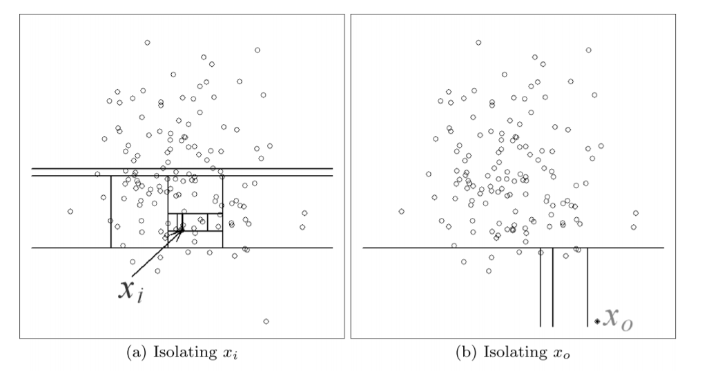

  (x0 is isolated very soon, insinuating that it's an anomaly)

  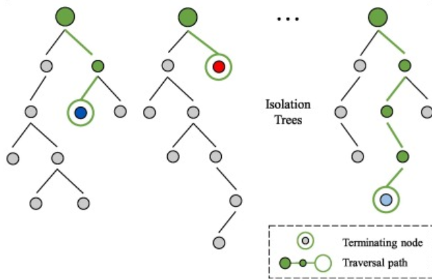

---
For more information, check this Colab notebook:

[Comparing Scikit's Isolation Forest and LOF, on a synthetic dataset](https://colab.research.google.com/drive/1mWeVArVdInSryIC6tRDiN3RgJNXVptP6)

---

## Fuzzy Sets ?

**Fuzzy logic** was introduced in mathematics as a **paradigmatic shift**
in the **perception of uncertainty**. Fuzzy logic was proposed by the
Professor Lotfi A. Zadeh of the University of California, Berkeley in 1965. The Fuzzy Logic **differs from classical** logic in that the statements **are no longer black or white**, **true or false**, **enabled or disabled**. 

In traditional logic, an object takes a value
zero or one. **In fuzzy logic**, an instruction **can take any real value
between 0 and 1**, representing the degree to which an element belongs to a given set.

> For Exemple: 
> 
> Let's consider a system having a temperature sensor, if T > 90°C it is considered faulty, else it works perfectly.
>

>  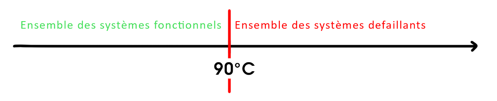
>

> 
> This implies that a system where the Temperature infinitesimally greater than 90°C is considered faulty, which isn't always the case. It would make sense to asses a **"degree of Faultiness"**
>

>  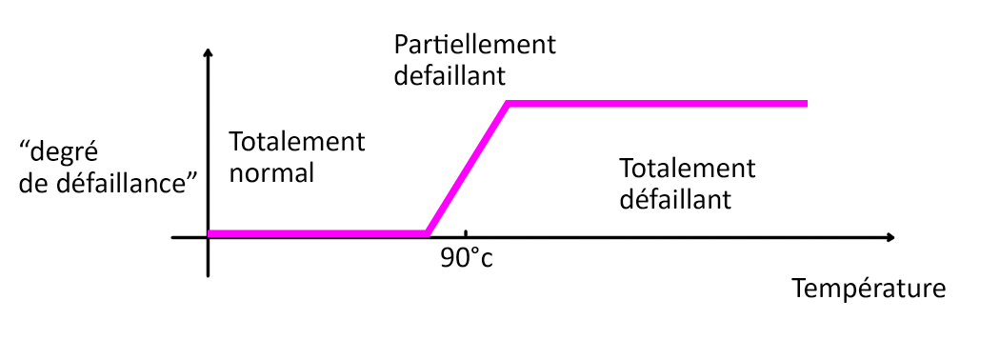
>

>

## Fuzzy Isolation Forest ?

In this project is an implementation of the Fuzzy Isolation Forest and its evaluation. Two main modules where implemented:
-   Fuzzifier module: Transforming data from the crisp Logic to a fuzzy one.
-   Fuzzy Isolation Forest based on alpha cuts approach.

## Fuzzifier Module

**A membership function** determines the membership of an element e to a set A.

 In Crisp data, this application from E returns either 0 (not in the set) or 1 (in the set).
-   fA: E => (0,1)

In Fuzzy Logic, f returns a value in R (but usally between 0 and 1, 0 being certain that e outside of the set A, and 1 fully certain that e is in A)
- fA: E => [0,1]

The problem in fuzzifying crisp data being the construction of pertinent membership functions, is quite hard and expert-dependent. The module gives the user the capability to chose the membership function from the set of the most used ones.

  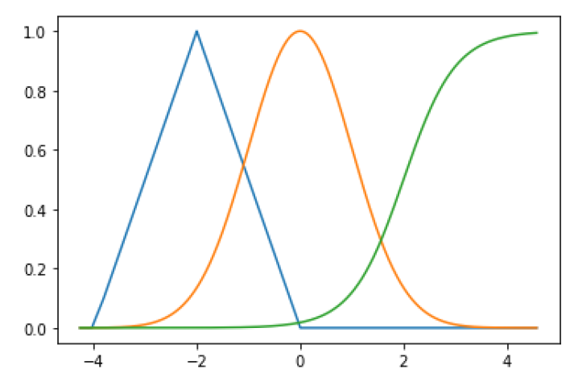

---
For more information, check this Colab notebook:

[SciKit Fuzzy On real Hand Exemple](https://colab.research.google.com/drive/1YDYMFvdT8H0LAung-hizTi32yNQUZmcN)

---

## Fuzzy Isolation Forest With Alpha cuts
We recall that the fundamental principle of fuzzy subsets is that an
entity x of the universe of the variable is no longer evaluated if it belongs to a set or no, but rather to the degree to which it belongs to the said set.

This then leads us directly to the problem of **partitioning fuzzy subsets**.

There are several fuzzy partitioning strategies, we will focus on during
this study on the most common: Creation of more classic scores (crisp) using alpha-cuts.

The partitioning of the nodes here could be done so that according to an attribute, the children of a given node form the set of all modalities.

>For example, consider the Size attribute with the Large - Medium - Small modalities with L’alpha-cut = 0.5.
>

>  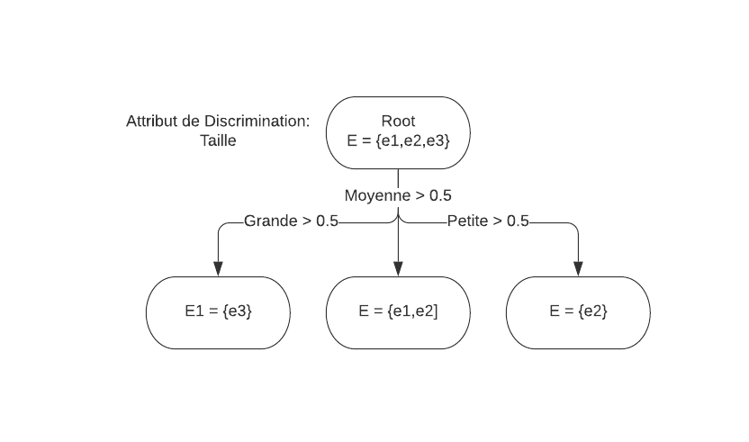
>  
(Alpha cuts partitionning on all modalities)

>

The downside with this technique is that we lose the properties of the tree binary, in particular the direct calculation of its average height used in the Isolation Forest on crisp data.

To remedy this, we could each time choose an Attribute but also the modality with which we partition the whole (also randomly) and then divide the whole depending on whether membership of the modality is greater than a given alpha-cut value:

>

>  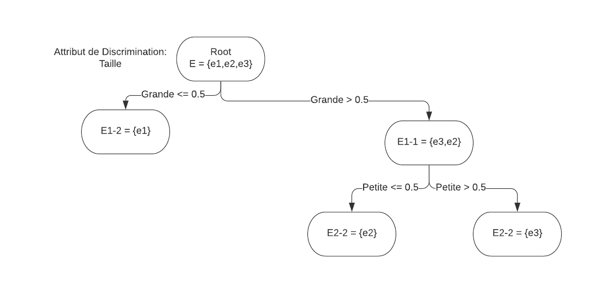
>  
(Binary partitionning of a fuzzy subset)

>

## Evaluation

### Used Datasets

    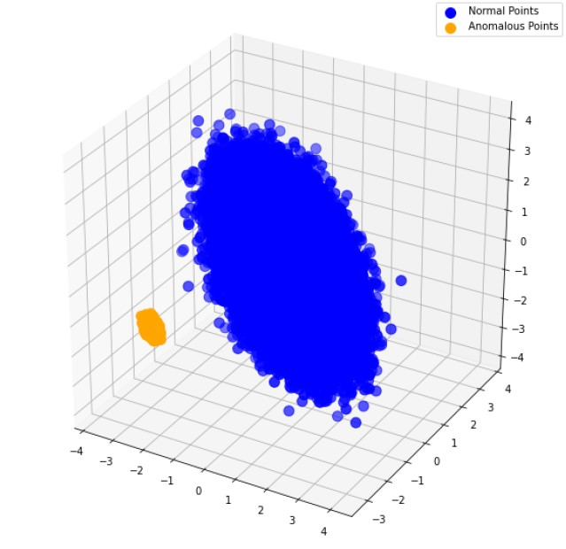
    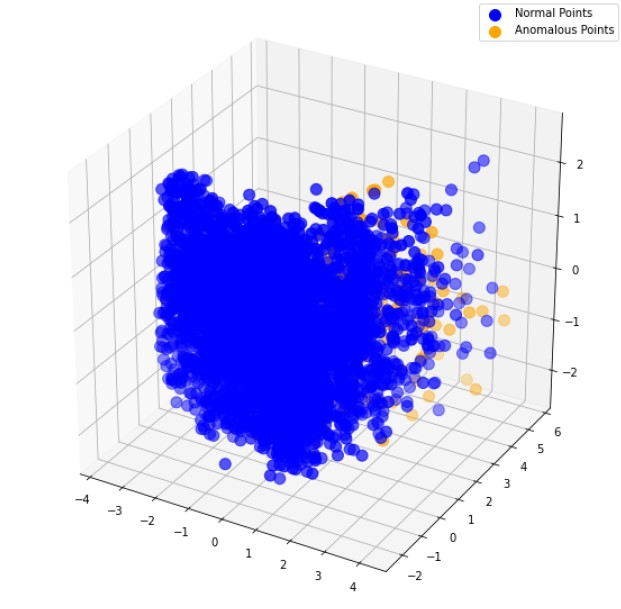
    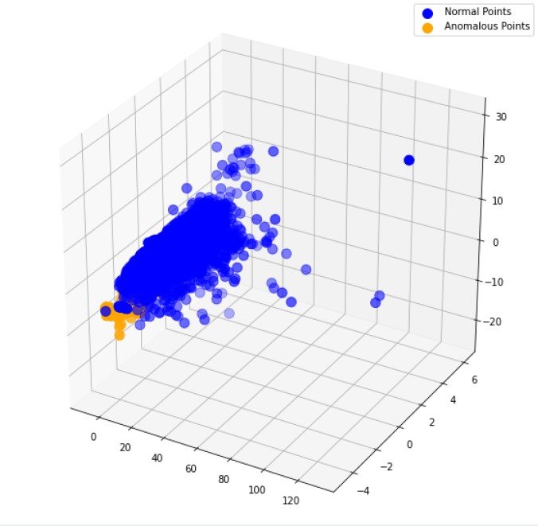

 

From left to right, Mulcross, Heart Disease and Credit Cards Dataset

### Results

  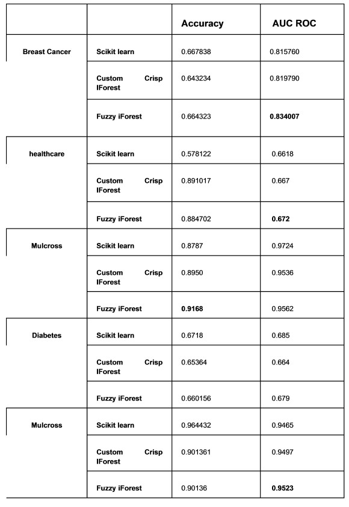

